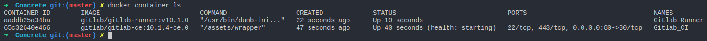
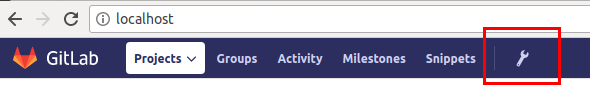
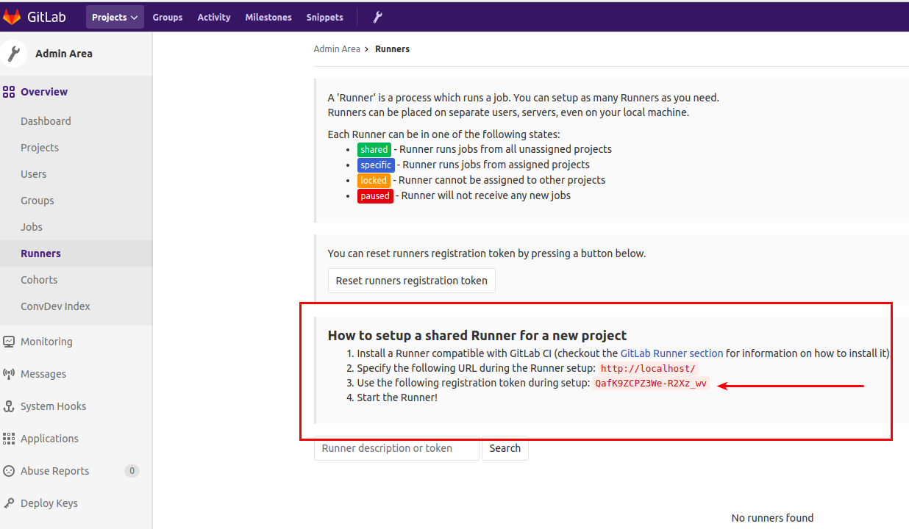
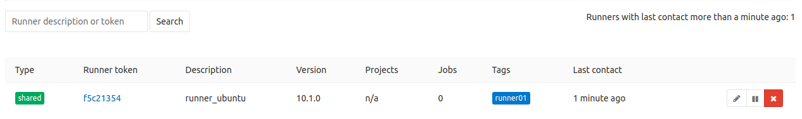
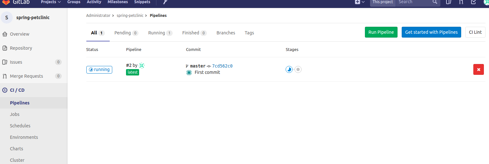
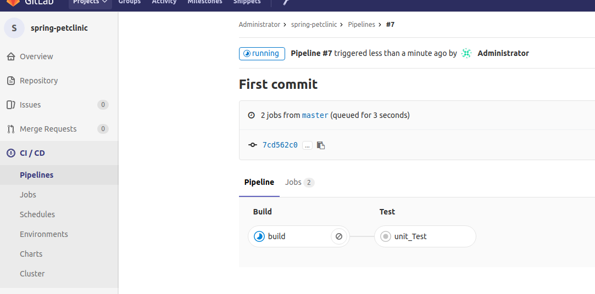
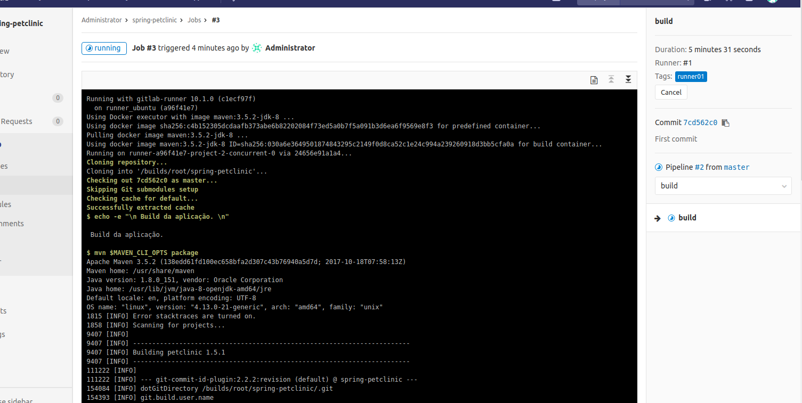

# Conheça o Gitlab CI

<p align="center"></p>

## Uma poderosa plataforma de códigos, agora com Continuous Integration & Deployment

Olá! O objetivo deste post é mostrar um pouco do que é o Gitlab CI e montar um lab, usando Docker, pra você ver o quão boa é essa plataforma e o que a diferencia dos outros serviços.

### O que é o Gitlab CI/CD

Todos nós da comunidade de desenvolvedores conhecemos várias plataformas de repositórios e Continuous Integration, e cada uma delas tem seus devidos destaques. Boa parte do mercado acaba selecionando uma plataforma para cada um deles (repositório, CI e CD, etc), fazendo com que haja um trabalho a mais para que a integração entre esses dois (ou até três) esteja completa e bem refinada para poder ser utilizada pelo seus times.

Mas por que não usar uma plataforma que possua todos esses serviços em um só ambiente? Essa é a proposta do [Gitlab Continuous Integration & Deployment](https://about.gitlab.com/features/gitlab-ci-cd/). Um _Plataform as a Service_ (PaaS) em que você pode _commitar_ o seu código, controlar a versão e fazer _code reviews_, testes de integração, _builds_, e _deployments_.


### Como funciona?

Ele é idêntico ao Gitlab que nós já conhecemos, um _web application_, com uma API, na qual você pode armazenar e gerenciar o seu projeto com uma baita interface, "digasse de passage", com todas as funções disponíveis pelo serviço. E para que o serviço de CI/CD funcione é necessário apenas adicionar o Gitlab Runner à sua arquitetura.

O Runner é uma aplicação que roda separadamente e trabalha junto ao Gitlab CI/CD, executando os _build_ e _deploy_ das aplicações identificadas. Eles podem ser executados em qualquer sistema operacional (Windows, MacOS, Linux) e também via Docker! Ou seja, para que você possa efetuar todo workflow de CI/CD é necessária ao menos 1 instância do Gitlab CI/CD e 1 Gitlab Runner rodando em um server, seu computador ou até mesmo _dockerizado_.

<p align="center"></p>

Com a plataforma montada e os serviços rodando, quando o código é _commitado_ o Runner é acionado e procura, dentro do repo, por um arquivo conhecido como `.gitlab-ci.yml`. É nesse arquivo que encontramos todo os jobs a serem executados pelo Gitlab (Pipeline as a Code), que pode variar de acordo com a branch em que ele será executado.

Abaixo um modelo bem simples da estrutura desse .yml

```yaml
image: ruby:2.1
services:
  - postgres

before_script:
  - bundle install

after_script:
  - rm secrets

stages:
  - build
  - test
  - deploy

job1:
  stage: build
  script:
    - execute-script-for-job1
  only:
    - master
  tags:
    - docker
```

### Montando seu próprio Gitlab CI com Docker

Para criar nosso lab vamos utilizar a última versão disponível, a v10.1. Caso queira  consultar mais infos sobre outras versões do Gitlab, acesse o [repositório oficial](https://hub.docker.com/r/gitlab/gitlab-ce/) no DockerHub.

Agora abra o seu terminal a faça download da imagem do Gitlab CE (Community Edition):

```terminal
docker pull gitlab/gitlab-ce:10.1.4-ce.0
```

O download é um pouco demorado. Após a conclusão, inicie o download do runner do GitlabCI com o comando abaixo. Veja que vamos utilizar também a versão 10 do Runner, pois se formos usar uma versão diferente do Gitlab CE que baixamos, há grande chances de incompatibilidades.

```terminal
docker pull gitlab/gitlab-runner:ubuntu-v10.1.0
```

Feito os downloads vamos iniciar o processo de criação dos containers. Crie uma pasta em algum diretório com o nome GitlabCI e dentro dela crie o arquivo ```docker-compose.yml```, adicionando as informações abaixo. Salve o arquivo. Essa é a receita que vai subir os containers, dar um hostname ao Gitlab CI e configurar a network deles e a persistência nos volumes.

_Caso não tenha o Docker-Compose em sua máquina, sua instalação e utilização estão disponíveis [aqui](https://docs.docker.com/compose/install/), na documentação oficial do Docker. E mais informações sobre o quão "bão" é o Compose você pode ler [neste post](https://www.concrete.com.br/2017/12/11/docker-compose-o-que-e-para-que-serve-o-que-come/)._

```yaml
version: '3'
services:
 Gitlab_CI:
  container_name: Gitlab_CI
  image: 'gitlab/gitlab-ce:10.1.4-ce.0'
  networks: 
   - 'DockerLAN'
  restart: always
  hostname: 'gitlab.docker'
  ports:
   - '80:80'
  volumes:
   - '/srv/gitlab/config:/etc/gitlab'
   - '/srv/gitlab/logs:/var/log/gitlab'
   - '/srv/gitlab/data:/var/opt/gitlab'
 Gitlab_Runner:
  container_name: Gitlab_Runner
  image: 'gitlab/gitlab-runner:v10.1.0'
  networks:
   - 'DockerLAN'
  restart: always
  volumes:
   - '/var/run/docker.sock:/var/run/docker.sock'
   - '/srv/gitlab-runner/config:/etc/gitlab-runner'
networks:
 DockerLAN:
  driver: bridge
```

No compose acima ele vai subir a instância do Gitlab_CI, com uma LAN dedicada a ele, configurando para ser iniciado sempre que a máquina também for iniciada. Além disso, ele vai dar um hostname ao container, liberar a porta 80 para acesso e criar a persistência no volume.<br>
Depois disso ele vai finalizar o processo iniciando o Gitlab Runner, linkando o container na 
LAN do Gitlab_CI, usar o mesmo método de inicialização e criar a persistência no volume.

Agora que temos nosso `docker-compose.yml` criado, ainda na pasta do projeto digite `docker-compose up -d` e você terá o retorno do compose como OK, informando que os containeres foram criados. Digite `docker container ls` e você verá que o container do Gitlab Runner já está rodando e o do Gitlab CI está sendo iniciado `(health: starting)`, como na imagem abaixo:



Esse processo de inicialização do container do Gitlab CI/CD demora em torno de 10 minutos. Então, enquanto o serviço é iniciado, vamos adicionar o host do Gitlab em nossos hosts conhecidos para facilitar o acesso. Abra o terminal e digite o comando do Docker para pegar o IP do container Gitlab_CI:

```docker
docker container inspect --format='{{range .NetworkSettings.Networks}}{{.IPAddress}}{{end}}' Gitlab_CI
```

Ele vai retornar o IP do container. Grave-o e depois digite:

```terminal
sudo vim /etc/hosts
```

Dentro desse arquivo adicione o IP e o host `gitlab.docker`, conforme o exemplo abaixo:

```hosts
127.0.0.1       localhost
172.0.0.1       outro.host
172.18.0.2      gitlab.docker
```

Salve o arquivo. Agora vamos aguardar o container ficar `healthy` para acessá-lo. Digite `docker container ls` e acompanhe a mudança do status. Quando estiver `healthy`, abra o seu navegador e digite `gitlab.docker/`

## Primeiro acesso ao Gitlab CE

No primeiro acesso ele vai solicitar a nova senha para o usuário "root". Digite uma de sua preferência. Logo em seguida ele vai te redirecionar a página de login da plataforma, aí você digita o usuário "root" e a senha que você definiu na página anterior.

Agora que já acessamos nosso Gitlab, precisamos configurar o Gitlab Runner para começar a fazer o upload dos projetos e a brincar com lab. Na parte superior do Gitlab, clique no ícone de configuração (exemplo na imagem abaixo):



E na página de configurações, do lado esquerdo, clique na opção "Runners"


Ao acessar a página veja que não temos nenhum Runner configurado, então vamos configurar, também utilizando os comandos via Docker :)

Abra o terminal e digite:

```docker
docker exec -i -t Gitlab_Runner sudo gitlab-runner register
```

Ele vai mostrar a mensagem abaixo, dando inicio à configuração do Runner. O primeiro passo é informar a URL do Gitlab, então digite o hostname do serviço como está descrito no exemplo abaixo e aperte Enter:

```terminal
Please enter the gitlab-ci coordinator URL (e.g. https://gitlab.com/):
http://gitlab.docker/
```

O próximo passo é informar o Registration Token. Para copiá-lo, vá na página dos Runners no Gitlab e copie a chave disponível na tela (exemplo abaixo). Cole no terminal e pressione enter:



Apos informar o Token ele vai solicitar a descrição do Runner. Digite a sua preferência, conforme a imagem mostra:

```terminal
Please enter the gitlab-ci description for this runner:
[ebce76428bsb]: runner_gitlab
```

Depois ele vai solicitar a Tag para esse Runner. É um passo muito importante pois é essa Tag que você vai utilizar nos jobs de suas pipelines para que eles funcionem corretamente. Pode usar a opção para que elas funcionem sem ela, mas vamos utilizá-la, já que é um processo mais detalhado e é bem legal conhecer. Descreva uma Tag fácil de se identificar, como no exemplo:

```terminal
Please enter the gitlab-ci tags for this runner (comma separated):
runner01
```

Após "_taggear_" o Runner, temos que indicar se ele poderá executar jobs não "_taggeados_" e se vamos travar o Runner apenas em 1 projeto. Vamos configurar para que os jobs sem Tags não sejam executados e deixar o runner compartilhado, assim todos os projetos que tiverem com a Tag ```runner01``` configurada serão executados.

```terminal
Whether to run untagged build [true/false]
[true]: false
whether to lock the Runner to current projeto [true/false]
[true]: false
```

Assim que essas informações forem adicionadas, o Register vai retornar uma mensagem informando que o registro foi efetuado com sucesso e a ID do Runner foi criada:

Para concluir o registro, vamos indicar qual executor do Runner vamos usar e a imagem padrão a ser utilizada. Neste caso vamos usar o executor Docker e uma imagem do alpine:3.5. Essa imagem padrão será utilizada caso não seja especificada nenhuma na execução do job na pipeline.

O executor Docker permite que você execute cada job em um container separado e isolado com uma imagem pré-definida em seu `.gitlab-ci.yml`

```bash
Please enter the executor: docker-ssh, parallels, kubernetes, docker-ssh+machine, docker, shell, ssh, virtualbox, docker+machine:
docker
Please enter the dafault Docker image (e.g. ruby:2.1):
alpine:3.5
```

_Mais informações sobre os outros executores do Gitlab CI, [clique aqui](https://docs.gitlab.com/runner/executors/README.html)_

Agora retorne ao Gitlab e veja que seu novo Runner está ativo



Antes de finalizar, porém, temos que fazer mais alguns ajustes dentro do Runner para que ele consiga identificar o Gitlab e fazer o pull dos projetos. Acesse o container do Gitlab Runner com o comando `docker container exec -t -i Gitlab_Runner /bin/bash` e navegue até a pasta `/etc/gitlab-runner`. Nela terá o arquivo `config.toml`, edite ele adicionando o campo `extra_hosts` conforme o exemplo abaixo, no qual do lado esquerdo está o hostname informado em nosso `docker-compose.yml` e do lado direito o IP de sua máquina ou alguma outra máquina em que o Docker seja o host:

```toml
concurrent = 1
check_interval = 0

[[runners]]
  name = "runner_ubuntu"
  url = "http://gitlab.docker/"
  token = "e2a798aec934eb3c36781c5f8f6c50"
  executor = "docker"
  [runners.docker]
    tls_verify = false
    image = "alpine:3.5"
    privileged = false
    disable_cache = false
    volumes = ["/cache"]
    shm_size = 0
    extra_hosts = ["gitlab.docker:_ip_do_docker_host_"]
  [runners.cache]

```

Precisamos configurar esse `extra_hosts`, se não no momento que o Runner executar o job ele não vai encontrar o container do Gitlab CI informado.

Agora que temos o nosso Gitlab CI "de pé" e o Runner está ativo e configurado, bora subir um projeto nele e criar nossa pipeline.

Para facilitar o processo, fiz uma cópia de um projeto muito utilizado no Github e reduzi alguns arquivos dele. Acesse [clicando aqui](https://gitlab.com/cs-leandro-lourenco/spring-petclinic.git) e faça o clone.

Agora acesse a pasta do projeto e remova a pasta .git, usando o comando `rm -r .git`.

Perfeito, mas antes de subir o projeto vamos criar o repositório remoto em nosso Gitlab CI no Docker. Acesse a url criada e, na barra superior no canto direito, clique no ícone de +, conforme a imagem abaixo:


Na seleção que abrir, clique em `New Project`. Dê um nome ao projeto (no caso podemos utilizar o mesmo nome, spring-petclinic), e clique no botão `Create project`. Pronto! Agora vamos voltar à pasta do projeto Petclinic para conectarmos ao repo remoto e construirmos nossa pipeline como código.

Dentro do repo, faça a conexão da pasta com o repositório utilizando esses comandos:

```git
git init
git remote add origin <url_do_repo>
git add .
git commit -m "Initial commit"
git push -u origin master
```

Pronto! Temos nosso projeto conectado e já com o primeiro commit feito.

Vamos agora à nossa pipeline.

Crie um arquivo chamado `.gitlab-ci.yml` e dentro dele copie as informações abaixo. Veja que comentei cada stage do processo para você entender melhor.

```yml
variables:
  # Essas variáveis irão impedir o download das dependências ou plugins que já estiverem no cache do M2.
  MAVEN_OPTS: "-Dmaven.repo.local=.m2/repository -Dorg.slf4j.simpleLogger.log.org.apache.maven.cli.transfer.Slf4jMavenTransferListener=WARN -Dorg.slf4j.simpleLogger.showDateTime=true -Djava.awt.headless=true"
  MAVEN_CLI_OPTS: "--batch-mode --errors --fail-at-end --show-version -DinstallAtEnd=true -DdeployAtEnd=true"

cache:
  paths:
    - .m2/repository

# Bloco de stages. São as fases da pipeline, e um stage pode conter mais de 1 job executando simultaneamente 
stages:
  - build
  - test

#1 Stage de build
build:
  image: maven:3.5.2-jdk-8
  stage: build
  tags:
    - runner01
  script:
    - echo -e "\n Build da aplicação. \n"
    - mvn $MAVEN_CLI_OPTS package
  artifacts:
    paths:
      - target/*spring-petclinic*.jar

#2 Stage de teste
unit_Test:
  image: maven:3.5.2-jdk-8
  stage: test
  tags:
    - runner01
  script:
    - echo -e "\n Teste unitário. \n"
    - mvn $MAVEN_CLI_OPTS test
    - cat target/site/jacoco/index.html
```

Após adicionar e salvar essas informações, _commite_ o arquivo no repo do projeto.

```terminal
git add .gitlab-ci.yml
git commit -m "First CI"
git push
```

Agora acesse o gitlab.docker e vá na área de CI/CD (conforme a imagem abaixo) e veja que nossa pipeline já está sendo executada.



Caso queira acompanhar o terminal sendo executado clique no botão `Running` e depois no botão do stage de build, e você poderá acompanhar a saída da execução do job.

<center>*Stages do Gitlab sendo executado na Pipeline*</center>

<center>*Terminal de saída do job no Gitlab CI/CD*</center>

E é isso! No `.gitlab-ci.yml` ainda podem ser adicionados muitos outros stages e funções. A Gitlab possui uma documentação bem detalhada com todas os recursos que podem ser utilizados no .yml e se você quiser ver é só acessar [este link](https://docs.gitlab.com/ce/ci/yaml/README.html).

Também vou deixar aqui algumas das documentações que me ajudaram bastante durante o discovery dessa plataforma e também na evolução deste post :D

* [Documentação Gitlab CI/CD](https://docs.gitlab.com/omnibus/README.html)
* [Documentação Gitlab Runner](https://docs.gitlab.com/runner/)
* [Gitlab CI/CD w/ Docker](https://docs.gitlab.com/omnibus/docker/README.html)
* [Gitlab Runner w/ Docker](https://docs.gitlab.com/runner/install/docker.html)
* [Configurações avançadas do Runner](https://docs.gitlab.com/runner/configuration/advanced-configuration.html)

Qualquer dúvida, é só deixar aqui no campo de comentários que respondo. Até a próxima!

--

Quer trabalhar com o melhor time de DevOps do Brasil? [Clique aqui](https://jobs.kenoby.com/concrete). 
